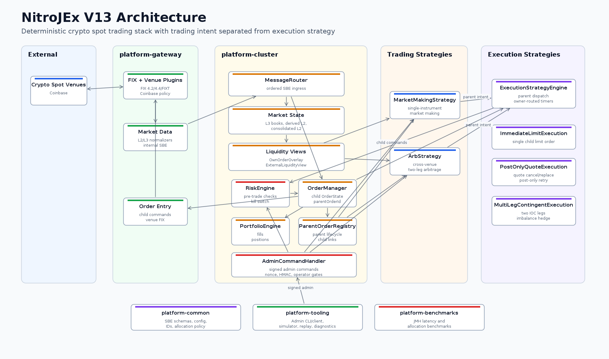

# NitroJ Exchange — High-Frequency Liquidity and Arbitrage Infrastructure
## A Multi-Venue, Multi-Strategy Pluggable Prop-Stack

**NitroJ Exchange** is a Java 21 low-latency trading platform, modular execution stack purpose-built for multi-venue market making and statistical arbitrage. It abstracts exchange-specific complexities into a unified, pluggable framework, allowing for sub-microsecond risk-checks and automated liquidity provision across fragmented markets. It provides venue connectivity, market-data normalization, order/risk state, and deterministic cluster-side strategy execution, with plugin-oriented extension points for adding new exchange/broker venues plus new trading and execution strategies.

The active development line is **V13.0**. V10.0 is preserved as the original frozen baseline, V11.0 is the frozen architecture baseline for multi-version FIX support, venue plugins, Coinbase FIX L3 support, L3-to-L2 derivation, consolidated L2 views, own-liquidity-aware arbitrage controls, and Coinbase simulator coverage, and V12.0 is the frozen low-latency hardening/evidence baseline for deterministic, zero-allocation steady-state hot paths. V13.0 supersedes V12.0 for the cluster strategy/execution layer only by adding a first-class execution strategy layer that separates trading intent from child-order execution.

This repository is not a financial recommendation system. It is infrastructure code. Real venue connectivity must go through QA/UAT, credential review, exchange certification/onboarding, and production risk controls before live use.

## Current Status

```text
Active spec:        NitroJEx_Master_Spec_V13.0.md
Active plan:        nitrojex_implementation_plan_v4.0.0.md
Migration doc:      NitroJEx_V12_to_V13_Migration.md
Release evidence:   release-evidence/v13/README.md
Frozen V12 spec:    NitroJEx_Master_Spec_V12.0.md
Frozen V12 plan:    nitrojex_implementation_plan_v3.0.0.md
V11->V12 migration: NitroJEx_V11_to_V12_Migration.md
Frozen V11 spec:    NitroJEx_Master_Spec_V11.0.md
Frozen V11 plan:    nitrojex_implementation_plan_v2.0.0.md
V10->V11 migration: NitroJEx_V10_to_V11_Migration.md
Frozen V10 spec:    NitroJEx_Master_Spec_V10.0.md
Frozen V10 plan:    nitrojex_implementation_plan_v1.4.0.md
```

Use the standard automated check command:

```bash
JAVA_HOME=/usr/lib/jvm/java-21-openjdk-amd64 ./gradlew check
```

The project should still be treated as **pre-QA / pre-UAT** for real Coinbase connectivity.

NitroJEx targets **zero-allocation steady-state hot paths**, not literal zero allocation across the whole repository. Startup/config parsing, admin tooling, simulator code, diagnostics, REST polling, and tests may allocate. The trading hot path is the part that must be benchmarked toward `0 B/op`.

## V12 Low-Latency Hardening

V12 is the low-latency, deterministic, zero-allocation hardening line. V11 establishes the architecture and Coinbase FIX L3 path, but it should not be marketed as fully proven zero-GC production trading infrastructure yet.

V12 goals:

- Prove steady-state hot-path allocation behavior with JMH and GC profilers, including published `B/op`, `alloc.rate`, and percentile latency results.
- Replace remaining hot-path `HashMap`, `LinkedHashMap`, `List`, `String`, records, and avoidable object creation with bounded primitive/off-heap/flyweight structures where justified.
- Remove or isolate FIX parsing and normalization paths that allocate `String`/`CharSequence` values for symbols, order IDs, venue order IDs, and market-data fields.
- Make venue L3 books, consolidated L2 books, own-order overlays, and strategy liquidity views allocation-free after warmup under configured capacity limits.
- Keep Coinbase REST JSON parsing explicitly outside the trading hot path, or replace it with a cold-path parser/boundary that cannot leak allocation-heavy objects into deterministic state.
- Add benchmark gates or CI reports that prevent claiming `0 B/op` until allocation evidence exists.
- Keep real Coinbase QA/UAT blocked until unit, integration, simulator, live-wire E2E, deterministic replay, and benchmark evidence gates pass.
- Complete real Coinbase certification/QA/UAT before production connectivity claims.
- Harden security and operations: secrets handling, credential rotation, audit trails, monitoring, alerting, failover, disaster recovery, and deployment evidence.
- Strengthen financial correctness: reconciliation, kill switch, risk limits, rejected-order handling, disconnect recovery, self-trade prevention validation, and audit-grade evidence before live trading.

V12 task-card work is complete, but production-facing claims still depend on
archiving current release evidence. Until the release evidence bundle is current,
the conservative claim remains:

```text
NitroJEx is designed toward low-latency deterministic hot paths and has a roadmap to verified zero allocation / zero GC behavior. V11 is not yet benchmark-proven zero-GC.
```

## V13 Execution Strategy Layer

V13 introduces a first-class execution strategy layer between trading strategies
and child order management. Trading strategies describe parent intent: quote,
take, hedge, or arbitrage objective. Execution strategies decide how child orders
are worked to realize that intent.

V13 goals:

- Add `ParentOrderIntent`, `ParentOrderUpdate`, and `ParentOrderTerminal` SBE messages.
- Add bounded `ParentOrderRegistry` state and parent-to-child mapping.
- Add `ExecutionStrategy`, `ExecutionStrategyContext`, and `ExecutionStrategyEngine`.
- Migrate `MarketMakingStrategy` to emit quote parent intents instead of child commands.
- Migrate `ArbStrategy` to emit multi-leg parent intents instead of owning leg/hedge lifecycle.
- Add built-in `ImmediateLimitExecution`, `PostOnlyQuoteExecution`, and `MultiLegContingentExecution`.
- Preserve V12 external behavior for `MarketMakingStrategy` and `ArbStrategy` when default execution strategies are used.
- Preserve V12 deterministic replay, hot-path allocation, own-order overlay, external-liquidity, risk, simulator, and benchmark gates.
- Require full task-owned expected-result coverage for parent cancel races, child rejects, timer races, hedging imbalance, hedge rejection, parent replay, snapshot/load, integration, E2E, and allocation evidence.

Default execution strategy mapping:

```text
MarketMaking -> PostOnlyQuote
Arb          -> MultiLegContingent
one-shot     -> ImmediateLimit
```

Every child order still passes pre-trade risk. `OrderState.parentOrderId` is the
authoritative child-to-parent attribution field on the hot path, while
`ParentOrderRegistry` owns parent lifecycle, active child lists, parent
fill aggregation, terminal reasons, snapshot/load, and parent recovery evidence.

V13 explicitly does not add TWAP, VWAP, POV, pegged order algorithms, smart order routing, new venue plugins, new FIX protocol plugins, or RiskEngine semantic changes.

## Architecture Diagram

The current V13 architecture targets cryptocurrency spot trading. Future asset
classes, venues, trading strategies, and execution strategies should extend the
same boundaries rather than bypassing them.



## Major Capabilities

- Multi-module Gradle build targeting Java 21.
- SBE schema generation for internal messages.
- Artio FIX codec generation.
- FIX protocol plugins for:
  - FIX 4.2
  - FIX 4.4
  - FIXT.1.1 / FIX 5.0SP2
- Venue plugin architecture separating venue behavior from FIX mechanics.
- Coinbase venue plugin with Coinbase-specific logon, order-entry policy, REST polling, and L2/L3 normalizers.
- Extensible venue plugin model for adding future exchange/broker venues without changing shared FIX protocol plugins or cluster strategy code.
- Configurable venue market-data model: `L2` or `L3`.
- Shared abstract FIX L2 and L3 market-data normalizers with venue enrichment hooks.
- Venue L3 book that derives per-venue L2.
- Consolidated L2 book across venues.
- Own order overlay and external liquidity view so strategies can reason about gross liquidity versus executable external liquidity.
- Built-in `MarketMakingStrategy` for quote generation using venue market data, spread configuration, inventory skew, quote sizing, and staleness checks.
- Built-in `ArbStrategy` for venue and cross-venue arbitrage using executable edge, external-liquidity views, risk checks, and multi-leg order submission.
- Strategy plugin extension model via `Strategy`, `StrategyContext`, and `StrategyEngine`, allowing additional strategies to be registered without changing the FIX or venue plugin layers.
- Execution strategy extension model for future order-routing and execution algorithms such as TWAP, VWAP, POV, smart order routing, pegged quoting, iceberg, and child-order slicing.
- V13 execution strategy layer for parent intents, parent state, and deterministic child-order lifecycle ownership.
- Coinbase exchange simulator plus deterministic L2/L3 simulator and live-wire E2E tests before real Coinbase QA/UAT.
- Startup scripts for one gateway process per venue.

## Repository Layout

```text
.
├── platform-common      Shared config, IDs, math, SBE schema, generated SBE codecs
├── platform-gateway     Artio gateway, FIX plugins, venue plugins, handlers, normalizers
├── platform-cluster     Cluster service, books, risk, order state, strategies
├── platform-tooling     Simulator, admin/replay/warmup tooling, test harness
├── config               Local/dev TOML config
├── scripts              Runtime startup wrappers
├── .prompt              Codex task prompts and compile notes
├── NitroJEx_Master_Spec_V10.0.md
├── NitroJEx_Master_Spec_V11.0.md
├── NitroJEx_V10_to_V11_Migration.md
├── NitroJEx_Master_Spec_V12.0.md
├── NitroJEx_V11_to_V12_Migration.md
├── NitroJEx_Master_Spec_V13.0.md
├── NitroJEx_V12_to_V13_Migration.md
├── nitrojex_implementation_plan_v1.4.0.md
├── nitrojex_implementation_plan_v2.0.0.md
├── nitrojex_implementation_plan_v3.0.0.md
└── nitrojex_implementation_plan_v4.0.0.md
```

## Modules

### `platform-common`

Owns shared types and generated wire codecs:

- `ConfigManager`
- `VenueConfig`, `GatewayConfig`, `ClusterNodeConfig`
- `FixPluginId`, `MarketDataModel`, `VenueCapabilities`
- fixed-point math helpers
- ID registry
- SBE message schema at `platform-common/src/main/resources/messages.xml`
- generated SBE Java source under `platform-common/src/generated/java`

SBE generation:

```bash
JAVA_HOME=/usr/lib/jvm/java-21-openjdk-amd64 ./gradlew :platform-common:generateSBE
```

### `platform-gateway`

Owns venue connectivity and gateway ingress/egress:

- `GatewayMain`
- Artio session loop and handlers
- Aeron publisher
- gateway disruptor
- FIX protocol plugin registry
- venue plugin registry
- shared L2/L3 FIX normalizers
- Coinbase venue plugin

Important packages:

```text
ig.rueishi.nitroj.exchange.gateway.fix
ig.rueishi.nitroj.exchange.gateway.marketdata
ig.rueishi.nitroj.exchange.gateway.venue
ig.rueishi.nitroj.exchange.gateway.venue.coinbase
```

Generated FIX codecs live in separate packages/directories so FIX versions do not collide:

```text
platform-gateway/src/generated/fix42/java
platform-gateway/src/generated/fix44/java
platform-gateway/src/generated/fixt11-fix50sp2/java
```

FIX codec generation:

```bash
JAVA_HOME=/usr/lib/jvm/java-21-openjdk-amd64 ./gradlew :platform-gateway:generateFix42Codecs
JAVA_HOME=/usr/lib/jvm/java-21-openjdk-amd64 ./gradlew :platform-gateway:generateFix44Codecs
JAVA_HOME=/usr/lib/jvm/java-21-openjdk-amd64 ./gradlew :platform-gateway:generateFixt11Fix50Sp2Codecs
```

### `platform-cluster`

Owns deterministic trading state and strategy logic:

- `TradingClusteredService`
- `L2OrderBook`
- `VenueL3Book`
- `ConsolidatedL2Book`
- `OwnOrderOverlay`
- `ExternalLiquidityView`
- `OrderManager`
- `RiskEngine`
- `PortfolioEngine`
- `MarketMakingStrategy`
- `ArbStrategy`

Important design rule: market books and NitroJEx own order state are separate. Execution reports are authoritative for own order state. Market data is the public venue view. `OwnOrderOverlay` and `ExternalLiquidityView` bridge both views when strategies need executable external liquidity.

### `platform-tooling`

Owns local tooling:

- `CoinbaseExchangeSimulator`
- simulator market-data publishing
- scenario controls
- admin CLI/client
- FIX replay tool
- warmup harness implementation
- shared trading system test harness

The admin CLI/client is a cold/control-plane support surface, including PROD
support workflows when enabled by deployment policy. It must communicate through
signed `AdminCommand` messages routed by `MessageRouter` into
`AdminCommandHandler`; it must not mutate cluster state directly. Its approved
responsibilities are:

- inspect state through supported admin, replay, diagnostic, or evidence views
- trigger approved admin commands such as activate/deactivate kill switch,
  pause/resume strategy, trigger snapshot, and reset daily counters
- replay scenarios through the FIX replay and simulator tooling
- run diagnostics and warmup/test harness workflows
- support operations without bypassing `RiskEngine`, `OrderManager`, cluster
  ordering, authorization, nonce validation, HMAC validation, or auditability

## Requirements

- Linux or WSL is recommended.
- Java 21 JDK.
- Gradle Wrapper from this repo.

Install Java 21 on Ubuntu/WSL if needed:

```bash
sudo apt update
sudo apt install openjdk-21-jdk
java -version
```

## Build

From the repo root:

```bash
cd ~/nitrojexchange
JAVA_HOME=/usr/lib/jvm/java-21-openjdk-amd64 ./gradlew build
```

Compile only:

```bash
JAVA_HOME=/usr/lib/jvm/java-21-openjdk-amd64 ./gradlew compileJava
```

Run all standard checks:

```bash
JAVA_HOME=/usr/lib/jvm/java-21-openjdk-amd64 ./gradlew check
```

Build runnable shadow jars:

```bash
JAVA_HOME=/usr/lib/jvm/java-21-openjdk-amd64 ./gradlew shadowJar
```

## Tests

Run all standard tests:

```bash
JAVA_HOME=/usr/lib/jvm/java-21-openjdk-amd64 ./gradlew test
```

Run all checks:

```bash
JAVA_HOME=/usr/lib/jvm/java-21-openjdk-amd64 ./gradlew check
```

Run module tests:

```bash
JAVA_HOME=/usr/lib/jvm/java-21-openjdk-amd64 ./gradlew :platform-common:test
JAVA_HOME=/usr/lib/jvm/java-21-openjdk-amd64 ./gradlew :platform-gateway:test
JAVA_HOME=/usr/lib/jvm/java-21-openjdk-amd64 ./gradlew :platform-cluster:test
JAVA_HOME=/usr/lib/jvm/java-21-openjdk-amd64 ./gradlew :platform-tooling:test
```

Run a specific test:

```bash
JAVA_HOME=/usr/lib/jvm/java-21-openjdk-amd64 ./gradlew :platform-gateway:test --tests ig.rueishi.nitroj.exchange.gateway.venue.coinbase.CoinbaseL3MarketDataNormalizerTest
```

Run explicit E2E source-set tests:

```bash
JAVA_HOME=/usr/lib/jvm/java-21-openjdk-amd64 ./gradlew e2eTest
```

Run hot-path allocation benchmarks:

```bash
JAVA_HOME=/usr/lib/jvm/java-21-openjdk-amd64 ./gradlew :platform-benchmarks:jmh
```

Run the automated latency report task:

```bash
JAVA_HOME=/usr/lib/jvm/java-21-openjdk-amd64 ./gradlew :platform-benchmarks:jmhLatencyReport
```

The benchmark task runs JMH with `-prof gc`; `:platform-benchmarks:jmhLatencyReport`
publishes the automated latency evidence. For the declared trading hot path,
`0 B/op` after warmup is the target. Any non-zero allocation must be treated as
evidence, not embarrassment: document the benchmark, owner, reason, and
remediation task before claiming zero-allocation readiness.

Run the V13 preflight gate:

```bash
JAVA_HOME=/usr/lib/jvm/java-21-openjdk-amd64 scripts/v13-preflight-check.sh
```

The V13 gate extends the V12 evidence set with parent/execution replay,
snapshot/recovery, live-wire parent-intent E2E, and parent/execution JMH
surfaces.

The default `test` task excludes tests tagged:

```text
E2E
SlowTest
RequiresProductionEnvironment
```

The `ciTest` task excludes:

```text
E2E
RequiresProductionEnvironment
```

## Configuration

Runtime config is TOML-based.

Important files:

```text
config/venues.toml
config/instruments.toml
config/gateway-1.toml
config/cluster-node-0.toml
config/cluster-node-1.toml
config/cluster-node-2.toml
config/admin.toml
```

### Venue Registry

`config/venues.toml` defines immutable venue IDs and venue capabilities.

Example Coinbase entry:

```toml
[[venue]]
id        = 1
name      = "COINBASE"
fixHost   = "fix.exchange.coinbase.com"
fixPort   = 4198
sandbox   = false
fixPlugin = "FIXT11_FIX50SP2"
venuePlugin = "COINBASE"
marketDataModel = "L3"
orderEntryEnabled = true
marketDataEnabled = true
nativeReplaceSupported = false
```

Operational rule: once assigned, venue IDs must not be reused. Persisted state, logs, and replay data refer to the numeric IDs.

### Gateway Config

`config/gateway-1.toml` binds a gateway process to one venue ID:

```toml
[process]
venueId = 1
nodeRole = "gateway"
```

The gateway loads:

```text
gateway config
venues.toml
instruments.toml
```

Production secrets are not stored in config. The config stores a Vault path:

```toml
[credentials]
vaultPath = "secret/trading/coinbase/venue-1"
```

Before live connectivity, credential resolution must provide the API key, secret, and passphrase expected by the selected venue plugin.

## Running Locally

Build first:

```bash
JAVA_HOME=/usr/lib/jvm/java-21-openjdk-amd64 ./gradlew shadowJar
```

Start a cluster node:

```bash
scripts/cluster-node-start.sh config/cluster-node-0.toml
```

Start the dedicated Coinbase gateway:

```bash
scripts/gateway-coinbase-start.sh
```

The generic gateway launcher requires the venue name explicitly:

```bash
scripts/gateway-start.sh COINBASE config/gateway-1.toml config/venues.toml config/instruments.toml
```

NitroJEx is designed for one gateway instance per venue. Future venues should add their own wrapper script, for example:

```text
scripts/gateway-binance-start.sh
scripts/gateway-kraken-start.sh
```

Those wrappers should delegate to `scripts/gateway-start.sh` with the venue name and correct config files.

## Coinbase FIX L2/L3 Readiness

V11 includes a Coinbase FIX L3 implementation path and shared L2/L3 market-data support:

- Coinbase venue plugin.
- Coinbase logon customization.
- Coinbase order-entry policy.
- Coinbase L2 and L3 normalizers.
- Coinbase simulator.
- Coinbase FIX L3 simulator tests.
- Concrete Coinbase L3 FIX normalizer tests.

Current automated Coinbase simulator coverage includes harness-level and live-wire
tests. It validates simulator-generated L2/L3 events, local TCP FIX simulator
sessions, gateway normalization, SBE events, L3 book updates, derived L2,
consolidated L2 behavior, strategy observation, egress, and order entry without
live Coinbase access.

The required pre-QA/UAT gate is explicit in the V12 plan: automated Coinbase
Simulator live-wire tests for both L2 and L3 must pass before real Coinbase
QA/UAT. Those tests start a local Coinbase simulator FIX endpoint/session fixture
and prove:

```text
Coinbase simulator FIX session
  -> gateway FIX session
  -> gateway disruptor
  -> Aeron Cluster ingress
  -> cluster market state/books/strategy observation
  -> cluster egress order command
  -> gateway OrderCommandHandler / ExecutionRouter
  -> Coinbase FIX order entry into simulator
  -> simulator ExecutionReport
  -> gateway ExecutionHandler
  -> cluster OrderManager / PortfolioEngine / RiskEngine / StrategyEngine
```

Required live-wire E2E classes:

```text
platform-tooling/src/e2eTest/java/ig/rueishi/nitroj/exchange/e2e/CoinbaseFixL2LiveWireE2ETest.java
platform-tooling/src/e2eTest/java/ig/rueishi/nitroj/exchange/e2e/CoinbaseFixL3LiveWireE2ETest.java
```

Before real Coinbase QA/UAT:

- Confirm current Coinbase FIX endpoint, TLS, FIX version, SenderCompID, TargetCompID, and dictionary requirements from Coinbase onboarding/docs.
- Confirm account/API key has FIX permissions enabled.
- Wire real credential resolution from Vault or the approved secret source.
- Run local unit/integration/simulator tests.
- Run automated Coinbase Simulator live-wire L2 and L3 E2E tests.
- Run Coinbase sandbox/UAT connectivity.
- Verify logon, heartbeat, resend/replay, sequence reset policy, market-data recovery, order entry, cancel, reject, disconnect, and reconnect flows.
- Only then consider production shadow/cutover.

## REST JSON Boundary

Coinbase REST polling is a cold/side path. `org.json` parsing is confined to Coinbase REST-owned gateway code and must not appear in cluster books, risk, order management, strategy APIs, or normal FIX market-data handling. REST-derived data must cross into the rest of the system as primitive internal state, DTOs, or SBE/admin events.

## Market Data Model

Each venue declares one market-data model:

```toml
marketDataModel = "L2"
```

or:

```toml
marketDataModel = "L3"
```

L2 venues publish price-level updates directly into per-venue L2 books.

L3 venues publish order-level updates into `VenueL3Book`. The system derives per-venue L2 from the active L3 state and can then update consolidated L2.

The current book model separates:

```text
VenueL3Book
  Order-level venue book.

L2OrderBook
  Per-venue price-level book.

ConsolidatedL2Book
  Cross-venue aggregated price-level book.

OwnOrderOverlay
  NitroJEx working-order visibility.

ExternalLiquidityView
  Gross market liquidity minus NitroJEx own visible liquidity where identifiable.
```

## Strategy Notes

NitroJEx's strategy layer is built around two current first-class trading use cases: market making and venue arbitrage. V11 includes `MarketMakingStrategy` and `ArbStrategy` as built-in implementations, while the cluster strategy contract remains open so new strategies can be added as plugins or separate modules.

### Market Making

`MarketMakingStrategy` uses venue market data, configured spreads, inventory skew, quote sizing, and staleness checks to produce quoting behavior.

For market making, L3 can be valuable because it can support queue-position awareness and exact own-order reconciliation when the venue exposes reliable order IDs. L2 is still useful for spread, top-of-book, and venue-level liquidity decisions.

### Arbitrage

`ArbStrategy` is treated as a multi-venue strategy. It scans configured venues, compares executable edge, and submits two venue legs when the opportunity exceeds the configured threshold.

Important V11 arbitrage controls:

- Use external executable liquidity, not raw gross L2 size.
- Avoid reacting to NitroJEx's own visible quote as if it were external liquidity.
- Use L2 conservative own-liquidity subtraction when only level data exists.
- Use L3 exact own-order matching when reliable venue order IDs exist.
- Perform self-cross checks before leg submission.
- Respect cooldowns and leg timeout controls.
- Use venue-native STP hooks where supported.

Coinbase STP is implemented as venue-specific order-entry enrichment in `CoinbaseOrderEntryPolicy`.

### Strategy Extension

New trading strategies plug into the cluster-side strategy layer by implementing `Strategy` and registering with `StrategyEngine`. The gateway, FIX plugin, and venue plugin layers do not need strategy-specific changes as long as the strategy consumes normalized market data and submits parent intents through the shared context.

`StrategyContext` is the supported dependency surface for strategy plugins. In V13 it exposes the execution engine in addition to the internal market view, external liquidity view, risk engine, order manager, portfolio engine, recovery coordinator, ID registry, counters, and Aeron cluster reference.

Trading strategy plugins decide what the system wants to do, such as quote, hedge, arbitrage, rebalance, or flatten risk. V13 execution strategy plugins decide how child orders should be worked for that parent intent. The V13 built-ins are immediate limit, post-only quote execution, and multi-leg contingent execution; TWAP, VWAP, POV, smart order routing, pegged orders, iceberg, and child-order slicing remain future release work.

Production strategy and execution implementations should remain deterministic under replay, avoid blocking work on the cluster thread, route every child order through risk/order APIs, and keep hot-path allocation behavior compatible with the V12/V13 low-latency hardening plan.

## FIX and Venue Plugin Design

V11 has two independent plugin axes, plus the cluster-side strategy extension layer.

FIX protocol plugins own protocol mechanics:

```text
BeginString
DefaultApplVerID
dictionary class
Artio session config
generated codec package
```

Venue plugins own venue behavior:

```text
authentication/logon customization
proprietary tags
order-entry policy
execution-report policy
market-data enrichment
venue capabilities
credential fallback
```

Additional venues are added by creating a venue-specific plugin package under `gateway/venue/<venue-name>`, implementing the shared venue contracts, registering the plugin, and supplying venue config. A new venue can choose any supported FIX protocol plugin, expose `L2` or `L3` market data, and add venue-specific logon, proprietary tags, STP, order-entry policy, execution-report normalization, and market-data enrichment.

Strategy plugins live in the cluster strategy layer and consume normalized internal state. This keeps market-making, venue arbitrage, and future trading/execution algorithms independent from venue-specific FIX details.

Shared abstractions live under:

```text
platform-gateway/src/main/java/ig/rueishi/nitroj/exchange/gateway/venue
```

Coinbase-specific production classes live under:

```text
platform-gateway/src/main/java/ig/rueishi/nitroj/exchange/gateway/venue/coinbase
```

## Generated Code

Generated code is intentionally visible to the IDE and build:

```text
platform-common/src/generated/java
platform-gateway/src/generated/fix42/java
platform-gateway/src/generated/fix44/java
platform-gateway/src/generated/fixt11-fix50sp2/java
```

Regenerate SBE and FIX code with:

```bash
JAVA_HOME=/usr/lib/jvm/java-21-openjdk-amd64 ./gradlew :platform-common:generateSBE
JAVA_HOME=/usr/lib/jvm/java-21-openjdk-amd64 ./gradlew :platform-gateway:generateFix42Codecs
JAVA_HOME=/usr/lib/jvm/java-21-openjdk-amd64 ./gradlew :platform-gateway:generateFix44Codecs
JAVA_HOME=/usr/lib/jvm/java-21-openjdk-amd64 ./gradlew :platform-gateway:generateFixt11Fix50Sp2Codecs
```

Normal compile/check tasks already depend on the required generation tasks.

## Development Rules

- Do not modify frozen V10, V11, or V12 spec/plan/migration files except for approved archival corrections.
- Use V13 spec and plan for active work.
- Use task IDs `TASK-301` and above for V13.
- Treat FIX parsing, SBE encode/decode, gateway handoff, book mutation, order state, risk, strategy tick, and order encoding as steady-state hot paths.
- Keep allocation-heavy work in cold/control paths: startup, config, admin, tooling, simulator, REST polling, diagnostics, and tests.
- Keep venue-specific behavior out of FIX protocol plugins.
- Keep FIX protocol mechanics out of venue plugins.
- Keep Coinbase classes under `gateway/venue/coinbase`.
- Keep shared venue abstractions under `gateway/venue`.
- Keep market books separate from own order state.
- Add tests for positive, negative, edge, exception, and failure paths where applicable.
- Add allocation and determinism evidence for every changed hot path.
- Real Coinbase QA/UAT is blocked until unit, integration, simulator, live-wire E2E, deterministic replay, and benchmark gates pass.

## Common Commands

```bash
# Full build
JAVA_HOME=/usr/lib/jvm/java-21-openjdk-amd64 ./gradlew build

# Full check
JAVA_HOME=/usr/lib/jvm/java-21-openjdk-amd64 ./gradlew check

# Compile gateway only
JAVA_HOME=/usr/lib/jvm/java-21-openjdk-amd64 ./gradlew :platform-gateway:compileJava

# Test cluster only
JAVA_HOME=/usr/lib/jvm/java-21-openjdk-amd64 ./gradlew :platform-cluster:test

# Test gateway only
JAVA_HOME=/usr/lib/jvm/java-21-openjdk-amd64 ./gradlew :platform-gateway:test

# Build runnable jars
JAVA_HOME=/usr/lib/jvm/java-21-openjdk-amd64 ./gradlew shadowJar
```

## Troubleshooting

### Gradle cannot find Java 21

Set `JAVA_HOME` explicitly:

```bash
export JAVA_HOME=/usr/lib/jvm/java-21-openjdk-amd64
./gradlew check
```

### Generated classes are missing

Run:

```bash
JAVA_HOME=/usr/lib/jvm/java-21-openjdk-amd64 ./gradlew clean compileJava
```

### Gateway script says venue mismatch

The explicit venue passed to `gateway-start.sh` must match `process.venueId` in the gateway config and the corresponding name in `venues.toml`.

Example:

```bash
scripts/gateway-start.sh COINBASE config/gateway-1.toml config/venues.toml config/instruments.toml
```

### Coinbase live connection fails before logon

Check:

- gateway jar exists
- venue name matches config
- FIX host/port are current for your Coinbase onboarding
- TLS requirements are satisfied
- SenderCompID and TargetCompID are correct
- credential resolver provides API key, secret, and passphrase
- selected FIX protocol plugin matches the venue config

## V13 Operations Runbooks

These runbooks are for the parent/execution strategy layer. They do not replace
venue outage, FIX session, credential, or risk runbooks.

### Parent Stuck

Signal: a parent remains `PENDING`, `WORKING`, `PARTIALLY_FILLED`, `HEDGING`, or
`CANCEL_PENDING` beyond its configured timer or operational SLA.

Actions:

- Check `ParentOrderRegistry` active parent count and parent terminal counters.
- Confirm active child links for the parent and inspect matching
  `OrderState.parentOrderId`.
- If no live child exists, cancel the parent through the execution engine and
  record `EXECUTION_ABORTED`.
- If a live child exists, cancel the child first, then wait for the parent
  terminal callback.
- If snapshot/recovery lost parent evidence or child attribution is inconsistent,
  activate the kill switch and reconcile before resuming.

### Child Stuck

Signal: a child order remains live or pending cancel while its parent has
terminal state, or a child execution report references an unknown parent.

Actions:

- Use `OrderState.parentOrderId` as the source of truth for attribution.
- Check `ParentOrderRegistry.parentOrderIdByChild(childClOrdId)` for active link
  evidence.
- Send a cancel for the child if the venue still reports it live.
- If the child references a missing parent, treat it as unreconciled risk and
  keep the kill switch active until order, balance, and parent evidence match.

### Hedge Rejected

Signal: `MultiLegContingentExecution` emits `HEDGE_FAILED`,
`hedge_risk_reject`, or `hedge_venue_reject`.

Actions:

- Keep the kill switch active.
- Confirm the filled leg quantity, pending leg cancel state, and attempted hedge
  child ID.
- Reconcile venue order status and balances before clearing the kill switch.
- Keep `ArbStrategy` cooldown active from the parent terminal callback.

### Post-Only Reject Loop

Signal: repeated post-only rejects or parent terminal reason `CHILD_REJECTED`
from `PostOnlyQuoteExecution`.

Actions:

- Verify the one-tick-deeper retry occurred once.
- Confirm market data is fresh and best bid/ask did not cross NitroJEx's quote.
- Leave market-making suppression/cooldown active if rejects repeat.
- Do not increase retry count without new replay, allocation, and simulator
  evidence.

### Capacity Full

Signal: parent capacity, child-link capacity, or order-state pool capacity
reject counters increase.

Actions:

- Stop accepting new parent intents for the affected strategy instance.
- Snapshot active parents, active child links, and live child orders.
- Increase configured capacity only after JMH and recovery tests prove the new
  bound remains deterministic and allocation-free after warmup.
- Do not claim V13 zero-allocation readiness while capacity rejects are active
  in the release evidence.

### Rollback To V12

Signal: parent registry, execution engine, benchmark, replay, or live-wire
parent-intent evidence fails after deployment rehearsal.

Actions:

- Stop the V13 cluster and gateway processes.
- Restore frozen V12 binaries and V12 strategy configuration.
- Use V12 migration and preflight documentation as the active release record.
- Reconcile all live venue orders and balances before allowing V12 strategy
  traffic.
- Do not use real Coinbase QA/UAT to compensate for missing V13 local evidence.

## Release Readiness

V13 production connectivity claims require evidence, not intent. Real Coinbase
QA/UAT remains blocked until the automated gates in
`config/v12-production-preflight.toml`, `scripts/v12-preflight-check.sh`, and
`config/v13-production-preflight.toml`, `scripts/v13-preflight-check.sh` pass and
the manual operational evidence is attached to the release record.

Before production:

- Run `scripts/v13-preflight-check.sh` and archive unit, integration, simulator,
  live-wire E2E, deterministic replay, parent snapshot/recovery, parent-intent
  live-wire E2E, JMH, and latency-report artifacts.
- Prove secrets handling and credential rotation: credentials must come from the
  approved secret source or injected environment, repository configs must remain
  non-production, and rotation must be rehearsed without code changes.
- Prove financial controls: kill switch, rejected orders, disconnect/reconnect,
  stale market data, self-trade prevention, and balance/position/order/execution
  reconciliation must have automated tests or signed runbook evidence.
- Prove operations controls: monitoring dashboards, alert routing, failover,
  disaster recovery, deployment, rollback, and shadow-mode cutover evidence must
  exist before live trading.
- Do not use real Coinbase QA/UAT to replace missing local evidence. QA/UAT is
  the final external venue validation step after local proof is complete.

## Future Strategy Catalog TODO

This section is a roadmap catalog for future development, not a statement of
current support. V13 currently implements two trading strategies and three
execution strategies:

Current V13 trading strategies:

- `MarketMakingStrategy`: single-instrument market making.
- `ArbStrategy`: cross-venue two-leg arbitrage.

Current V13 execution strategies:

- `ImmediateLimitExecution`: one limit child order.
- `PostOnlyQuoteExecution`: post-only quote lifecycle with bounded retry.
- `MultiLegContingentExecution`: two-leg IOC execution with leg timeout,
  imbalance hedge, and kill-switch escalation on hedge failure.

All other items below are TODO candidates for V14+ or later releases. They must
not be treated as implemented until a future spec, implementation plan, task
cards, tests, benchmarks, deterministic replay evidence, simulator evidence, and
preflight gates explicitly cover them. Any reference to time or scheduling below
must be implemented with NitroJEx deterministic cluster time, not uncontrolled
wall-clock callbacks.

Current asset-class scope is cryptocurrency spot trading. Future development may
add other spot asset classes such as FX, equity stocks, and index funds, but
those require separate venue adapters, market-data normalizers, order semantics,
calendar/session handling, regulatory controls, QA/UAT evidence, and preflight
gates before any support claim is made.

### Future Trading Strategies

Liquidity-providing strategies:

- Single-instrument market making: implemented in V13 as `MarketMakingStrategy`.
- Multi-instrument market making: one strategy class parameterized over a list
  of instruments, with correlated inventory management.
- Multi-venue market making: quote the same instrument across venues with
  cross-venue inventory netting and per-venue spread/skew calibration.
- Adaptive-spread market making: spread responds to realized volatility, fill
  rate, and adverse-selection signals.
- Quote-stuffing-aware market making: detect venue-side message storms and widen
  or withdraw quotes.
- Inventory-rebalancing market making: quote asymmetrically or cross the spread
  when inventory exceeds soft thresholds.
- Single-venue passive arbitrage / queue jockey: join the touch using L3
  queue-position estimation.
- Auction market making: participate in opening, closing, and intraday auctions.
- RFQ-responder market making: answer quote requests with skewed quotes and
  decline-to-quote rules.
- Options market making: quote calls/puts across a volatility surface with
  continuous delta hedging.
- Tiered quoting: combine wide-and-large passive quotes with tight-and-small
  topping quotes.

Liquidity-taking arbitrage strategies:

- Cross-venue arbitrage (two-leg): implemented in V13 as `ArbStrategy`.
- Triangular arbitrage: three-leg same-venue arbitrage across related pairs.
- Statistical arbitrage / pairs trading: trade cointegrated pairs on z-score
  divergence and mean reversion.
- Mean-reversion stat-arb basket: trade residuals of a multi-instrument factor
  model.
- Index arbitrage: trade an index product against its constituent basket.
- ETF arbitrage: creation/redemption style ETF versus basket arbitrage.
- Funding-rate arbitrage: pair spot and perpetual swap exposure to capture
  funding.
- Basis arbitrage: trade futures versus spot convergence.
- Cash-and-carry arbitrage: long spot and short forward/future to lock basis.
- Calendar-spread arbitrage: trade front-month versus back-month futures spread.
- Latency arbitrage: take stale quotes on slower venues after faster venues move.
- CEX-DEX arbitrage: trade centralized versus decentralized exchange price
  differences.
- Volatility arbitrage: delta-hedged options positions versus realized
  volatility.
- Dispersion trading: index volatility versus constituent volatility.

Signal-driven directional strategies:

- Microstructure mean reversion: short-horizon reversion after unusual moves.
- Order-flow imbalance trading: trade with aggressive flow imbalance.
- Trend-following / momentum: enter breakouts with trailing-stop exits.
- Cross-sectional momentum: long winners and short losers across a universe.
- Pairs momentum: apply momentum to a spread between related instruments.
- Mean-reversion swing: longer-horizon reversion against extended moves.
- News-driven trading: map news events to instruments and directional intents.
- Sentiment-driven trading: use social/forum sentiment as directional input.
- Liquidity-seeking directional: bias execution when unusual depth appears.
- Block-detection trading: trade behind inferred institutional block flow.
- Iceberg-detection trading: infer hidden refresh behavior and trade around it.

Risk-management and meta-strategies:

- Auto-hedger: hedge aggregate firm exposure without generating alpha.
- Inventory liquidator: flatten open positions before a configured cutoff.
- Stop-out monitor: trigger kill switch on drawdown limits.
- Portfolio rebalancer: move portfolio toward target weights.
- Delta hedger: continuously hedge options-book delta.
- Gamma scalper: trade realized volatility around an options position.
- Currency-exposure hedger: net FX pairs into currency-level exposure and hedge.

Execution-quality strategies, alpha-less:

- One-shot intent submitter: emit one parent intent for a selected execution
  strategy.
- Schedule-based intent submitter: emit parent intents on deterministic cluster
  schedule.
- Implementation-shortfall trader: manage urgency versus arrival-price
  benchmark at the trading-intent layer.
- Smart liquidity-seeking trader: adjust urgency hints from observed liquidity
  and fill quality.
- Slippage-budget trader: work a parent order against a benchmark budget.

Specialty strategies:

- A/B research overlay: run research behavior at small size beside production.
- Time-of-day specialist: activate behavior for a regional session.
- Risk-segregated strategy: run against a separate capital pool and drawdown
  limits.
- Funding-event trader: trade around scheduled funding, expiry, rollover, or
  economic events.
- Cross-asset relative value: trade relationships across asset classes.

### Future Execution Strategies

Single-child-order executions:

- `ImmediateLimitExecution`: implemented in V13.
- `ImmediateMarketExecution`: submit one market child order.
- `ImmediateIOCExecution`: submit one immediate-or-cancel child order.
- `ImmediateFOKExecution`: submit one fill-or-kill child order.
- `StopMarketExecution`: trigger a market child when price is breached.
- `StopLimitExecution`: trigger a limit child when price is breached.
- `TrailingStopExecution`: stop trigger tracks favorable market moves.
- `MarketWithProtectionExecution`: market child with price collar.
- `GTDLimitExecution`: limit child with deterministic expiry.

Working-quote executions:

- `PostOnlyQuoteExecution`: implemented in V13.
- `CrossingQuoteExecution`: refresh quotes that may cross the spread.
- `PeggedQuoteExecution`: peg child price to a reference with offset.
- `DiscretionaryQuoteExecution`: hidden discretionary range around stated price.
- `JoinQueueExecution`: join the existing queue at the touch.
- `HiddenQuoteExecution`: fully hidden venue-supported orders.
- `ReserveQuoteExecution`: venue-side iceberg / reserve orders.

Multi-leg and contingent executions:

- `MultiLegContingentExecution`: implemented in V13.
- `MultiLegContingentExecutionN`: N-leg generalization for triangular and more
  complex trades.
- `BracketExecution`: entry plus take-profit and stop-loss OCO children.
- `OCOExecution`: generic one-cancels-other pair.
- `LeggingInExecution`: configurable leg sequence for multi-leg trades.

Algorithmic time-based executions:

- `TwapExecution`: equal slices over a deterministic time window.
- `VwapExecution`: slices following expected volume profile.
- `PovExecution`: participate at target percentage of observed volume.
- `AdaptivePovExecution`: POV target adapts to spread, volatility, and fill
  quality.
- `ImplementationShortfallExecution`: optimize impact versus opportunity cost.
- `ArrivalPriceExecution`: benchmark against parent arrival mid.
- `ScheduledExecution`: deterministic-clock anchored single submission.

Hidden-liquidity executions:

- `IcebergVenueExecution`: venue-side iceberg using max-floor fields.
- `IcebergSyntheticExecution`: client-side visible slices.
- `IcebergRandomizedExecution`: randomized synthetic slices and prices.
- `DarkPoolFirstExecution`: dark venues first, lit venues as fallback.

Smart-routing executions:

- `SmartOrderRoutingExecution`: split across venues by price, fees, and fill
  probability.
- `IsoSweepExecution`: equities-specific intermarket sweep order.
- `SequentialVenueExecution`: try venues in priority order.
- `LiquiditySeekingExecution`: adapt venue weights from depth and fill quality.
- `ParallelVenueExecution`: submit to multiple venues simultaneously.

RFQ and quote-driven executions:

- `RFQAcceptExecution`: request quotes and accept best response.
- `LastLookAwareExecution`: bias IOC venue selection by last-look reject risk.
- `StreamHitterExecution`: hit streaming bank quotes.
- `MultiBankSweepExecution`: distribute parent size across bank streams.

Auction and event executions:

- `AuctionParticipationExecution`: opening/closing auction order types.
- `ClosingAuctionExecution`: closing-auction execution with imbalance awareness.
- `EventDrivenExecution`: trigger from news, economic, or on-chain events.
- `FundingEventExecution`: time entries/exits around funding windows.

Specialty executions:

- `SyntheticOrderExecution`: synthesize unsupported order types from primitives.
- `CancelOnDisconnectExecution`: cancel children when venue session drops.
- `TimeWindowExecution`: active only inside configured deterministic time window.
- `FillAndKillExecution`: wait briefly, then cancel residual.
- `MinQtyExecution`: submit with minimum-quantity constraint.
- `ReduceOnlyExecution`: derivatives reduce-only constraint.
- `CloseOnlyExecution`: close existing positions only.
- `PostTradeAllocationExecution`: allocate fills across sub-accounts after trade.
